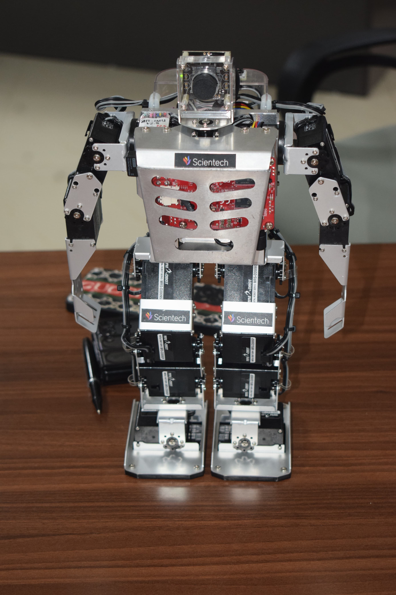

# Robonova AI 3 - Humanoid Robot Platform

A responsive web-based interface for showcasing the **Robonova AI 3** humanoid robot developed by Scientech. This page highlights the robot’s capabilities in education, research, prototyping, and AI-driven tasks.

## 🧠 Overview

Robonova AI 3 is an intelligent bipedal humanoid robot with 17 servo motors, a built-in AI processing unit, and a high-resolution vision system. It is ideal for academic labs, robotics competitions, and real-world prototyping.

## 🔍 Features

- 17 HSR-8498 digital servos
- AI processing unit (Quad-core ARM Cortex-A53 CPU)
- Ubuntu 16.04 OS with OpenCV 3.4.2
- Full HD camera module for computer vision
- Bluetooth and Ethernet connectivity
- Programmable via ROBOBASIC and ROBOSCRIPT
- Expandable GPIO and HDMI output

## 📁 File Structure

